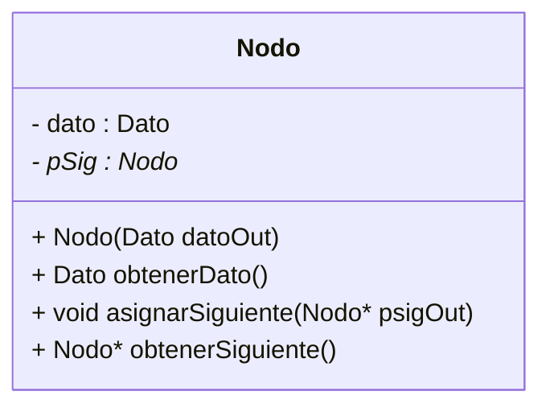
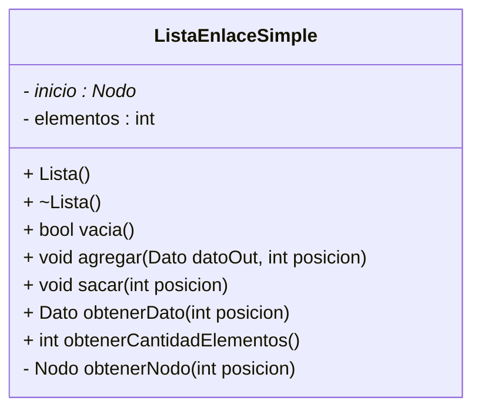
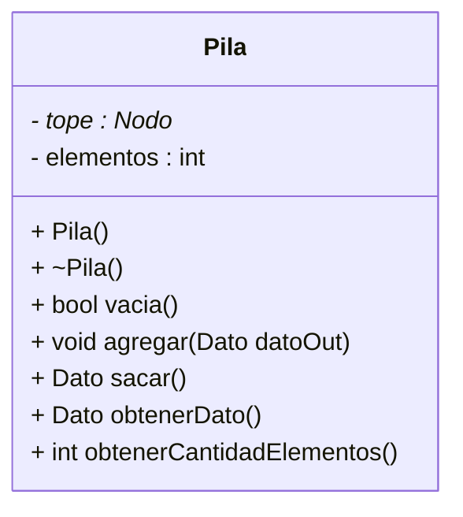
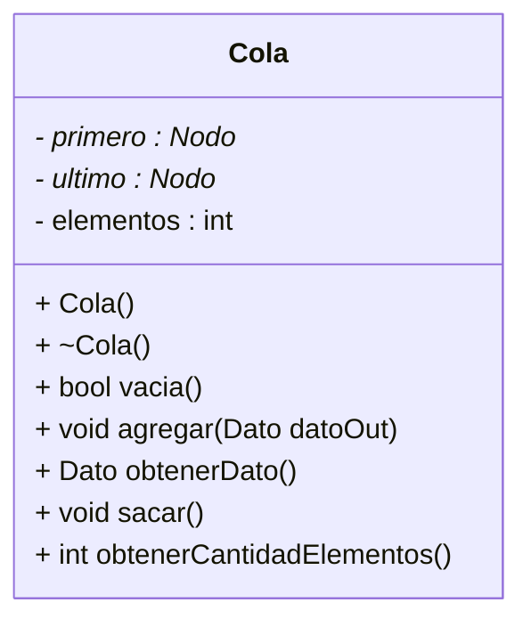

Listas
======

[TOC]

*Nota 1: los nombres elegidos para algunas clases que puse como ejemplo son una MALA práctica. Los puse para mayor claridad, pero no esta bueno básicamente porque la POO se basa en el ocultamiento de la implementación y la abstracción de datos. Entonces si pongo como se va a implementar en el nombre de la clase se pierde un poco esto. Además si en el futuro se cambia la implementación, habría que modificar el nombre de la clase y todas sus apariciones, y paja.* 

*Nota 2: no haber puesto las PRE y POST condiciones en los headers de las clases es una MALA práctica. No los puse simplemente para escribir menos, y porque esto es a modo de apunte, pero siempre van. Siempre.*

Nodos
-----

Un nodo tiene un dato o valor, y un puntero a otro(s) nodo(s). Para las listas simplemente enlazadas, las pilas y colas, se necesitan nodos con un solo puntero.


### TDA



### Clase

``` c++
// Nodo.h
using namespace std;

typedef int Dato;
const int NULO = 0;

class Nodo {

    private:
        Dato dato;
        Nodo* pSig;

    public:
        // Constructor con parametro
        // PRE: -
        // POST: crea un nodo con el dato datoOut y el puntero a NULL
        Nodo(Dato datoOut = NULO);
    
        // Setea el puntero al siguiente nodo
        // PRE: el nodo tiene que estar creado
        // POST: el puntero al siguiente nodo apuntará a pSigOut
        void asignarSiguiente(Nodo* pSigOut);
    
        // Setea el dato
        // PRE: el nodo tiene que estar creado
        // POST: el nodo queda con el dato datoOut
        void asignarDato(Dato datoOut);
    
        // Obtener el dato
        // PRE: el nodo tiene que estar creado
        // POST: devuelve el dato que contiene el nodo
        Dato obtenerDato();
    
        // Obtener el puntero al siguiente nodo
        // PRE: el nodo tiene que estar creado
        // POST: devuelve el puntero al siguiente nodo, si es el ultimo devuelve NULL
        Nodo* obtenerSiguiente();
    
        // Muestra el dato que contiene el nodo, la dirección en la que esta y la dirección 		// de pSig
        // PRE: el nodo tiene que estar creado
        // POST: Muestra el dato que contiene el nodo, la dirección en la que esta y la 			// dirección de pSig
        void mostrarDato();
};
```

```c++
// Nodo.cpp
#include "Nodo.h"
#include <iostream>

// Constructor
Nodo:: Nodo(Dato datoOut) {
    dato = datoOut;
    pSig = 0;
}

// <-------------------- Setters
void Nodo:: asignarSiguiente(Nodo* pSigOut) {
    pSig = pSigOut;
}

void Nodo:: asignarDato(Dato datoOut) {
    dato = datoOut;
}
// -------------------->

// <-------------------- Getters
Nodo* Nodo:: obtenerSiguiente() {
    return pSig;
}

Dato Nodo:: obtenerDato() {
    return dato;
}
// -------------------->

void Nodo:: mostrarDato() {
    cout << "----------------------------------------------------------------\n";
    cout << "Nodo -> Dato: " << dato << "  Dirección: " << this << "  Siguiente: " 
         << pSig << "\n";
    cout << "----------------------------------------------------------------\n\n";
}
```


Lista Simplemente Enlazada
---------------------------

Una lista es una estructura de datos lineal flexible, que crece o se acorta a medida que se insertan o se borran elementos. En el caso de las listas simples, se pueden dar de alta y de baja en y desde cualquier posición sin restricciones.

Hay cosas que habrá que tener en cuenta en base a que querramos hacer con esa lista, algunas preguntas que pueden surgir son:

-   ¿Voy a agregar un dato en una posición x que se recibe como parámetro, o lo voy a agregar en base a un orden particular que tenga que tener esa lista?
-   Para sacar un elemento de la lista, ¿lo hago en base a la posición, o al dato ¿Y que pasa si un dato esta repetido? ¿Saco el primero o todos?
-   Para obtener un elemento de la lista, ¿lo hago en base a la posición, o al dato? ¿Y que se devuelve en caso de que no se encuentre el dato?

Supongamos que tengo la siguiente lista y quiero agregar un dato


El dato nuevo, lo quiero agregar en entre el Nodo 2 y el Nodo 3 (ya sea porque la recibí como parámetro, o porque según el orden de la lista es donde debería estar). Lo primero que hay que hacer es que ese dato nuevo apunte al que será luego su dato siguiente


Luego, que el Nodo 2 apunte apunte al Nodo nuevo


Finalmente quedaría


### TDA



### Clase

```c++
// ListaEnlaceSimple.h
#include "Nodo.h"

class ListaEnlaceSimple {

    private:
        Nodo* primero;
        int elementos;

    public:
        // Constructor
        // PRE: -
        // POST: crea una lista vacía con elementos = 0 y primero apuntando a nulo
        ListaEnlaceSimple();

        // Destructor
        // PRE: la lista fue creada
        // POST: libera todos los recursos de la lista
        ~ListaEnlaceSimple();

        // Obtener el dato que está en posicion
        // PRE: lista creada, no vacía y  0 < posicion <= elementos
        // POST: devuelve el dato que está en posición. Se toma 1 como la primera posición
        Dato obtenerDato(int posicion);

        // Obtener el tamaño de la lista
        // PRE: la lista fue creada
        // POST: devuelve elementos (cantidad de nodos de la lista)
        int obtenerCantidadElementos();

        // Agregar un elemento a la lista en una posicion
        // PRE: la lista fue creada, datoOut es un Dato válido y  0 < posicion <= elementos
        // POST: agrega un dato (dentro de un nodo) en la posicion e incrementa tam en 1	
        void agregarEnPosicion(Dato datoOut, int posicion);

        // Agregar un elemento a la lista al principio
        // PRE: la lista fue creada y datoOut es un Dato válido
        // POST: agrega un dato (dentro de un nodo) al final e incrementa tam en 1	
        void agregarAlFinal(Dato datoOut);
    
        // Borrado del nodo que está en posicion
        // PRE: la lista fue creada, 0 < posicion <= elementos y posicion es un entero valido
        // POST: libera el nodo que esta en la posicion recibida. Se toma 1 como primero
        void sacar(int posicion);
    
        // La lista es vacía?
        // PRE: la lista fue creada
        // POST: devuelve verdadero si la lista es vacia, falso de lo contrario
        bool vacia();
    
        // Muestra los datos de los nodos
        // PRE: la lista fue creada y no es vacia
        // POST: muestra por pantalla los datos de los nodos de la lista
        void mostrarDatos();

    private:
        // Devuelve el nodo de la posicion
        // PRE: la lista fue creada y  0 < posicion <= elementos
        // POST: devuelve el nodo de la posicion
        Nodo* obtenerNodo(int posicion);
};
```


```c++
#include "ListaEnlaceSimple.h"

ListaEnlaceSimple:: ListaEnlaceSimple () {
    primero = 0;
    elementos = 0;
}

ListaEnlaceSimple:: ~ListaEnlaceSimple() {
    while (!vacia())
        // Mientras queden elementos, voy siempre sacando el que este en la posicion 1
        sacar(1);
}

// <-------------------- Getters
Dato ListaEnlaceSimple:: obtenerDato(int posicion) {
    return obtenerNodo(posicion)->obtenerDato();
}

int ListaEnlaceSimple:: obtenerCantidadElementos() {
    return elementos;
}

Nodo* ListaEnlaceSimple:: obtenerNodo(int posicion) {
    Nodo *aux = primero;
    int i = 1;
    while (i < posicion) {
        aux = aux->obtenerSiguiente();
        i++;
    }
    return aux;
}
// -------------------->

bool ListaEnlaceSimple:: vacia() {
    return primero == 0;
}

void ListaEnlaceSimple:: agregarAlFinal(Dato datoOut) {
    Nodo* nuevoNodo = new Nodo(datoOut);
    Nodo* pAux = primero;
    if (this->vacia())
        primero = nuevoNodo;
    else {

        while (pAux->obtenerSiguiente() != 0)
            pAux = pAux->obtenerSiguiente();
        pAux->asignarSiguiente(nuevoNodo);
    }
    elementos++;
}

void ListaEnlaceSimple:: agregarEnPosicion(Dato datoOut, int posicion) {
    Nodo* nuevoPrimero = new Nodo(datoOut);
    if (posicion == 1) {
        nuevoPrimero->asignarSiguiente(primero);
        primero = nuevoPrimero;
    }
    else {
        Nodo* anterior = obtenerNodo(posicion - 1);
        nuevoPrimero->asignarSiguiente(anterior->obtenerSiguiente());
        anterior->asignarSiguiente(nuevoPrimero);
    }
    elementos++;
}

void ListaEnlaceSimple:: sacar(int posicion) {
    Nodo* borrar = primero;
    if (posicion == 1) {
        primero = borrar->obtenerSiguiente();
    }
    else {
        Nodo* anterior = obtenerNodo(posicion - 1);
        borrar = anterior->obtenerSiguiente();
        anterior->asignarSiguiente(borrar->obtenerSiguiente());
    }
    delete borrar;
    elementos--;
}

void ListaEnlaceSimple:: mostrarDatos() {
    if (!vacia()) {
        for (int i = 1; i < elementos; i++) {
            obtenerNodo(i)->mostrarDato();
        }
    }
}
```

### Main

```c++
int main() {

    ListaDinamica listaNumeros;

    cout << "\n";
    for (int i = 1; i <= 5; i++) {
        listaNumeros.agregarEnPosicion(i*2, i);
    }
    cout << "\n";
    listaNumeros.mostrarDatos();

    listaNumeros.sacar(2);
    listaNumeros.listarElementos();
    listaNumeros.mostrarDatos();

    listaNumeros.sacar(2);
    listaNumeros.listarElementos();
    listaNumeros.mostrarDatos();

    return 0;
}
```

La salida del código anterior es:

*Nota: para poder ver una salida, agregue unos couts en los metodos agregar y sacar que NO están en el ejemplo de lista  anterior.*


Pilas o Stacks
--------------

Una pila es una estructura de datos de tipo LIFO, en la cual los elementos almacenados en la misma se agregan y se sacan del tope de la pila. De esta manera el último elemento en ser insertado es el primero en salir.


Si bien se puede implementar de manera estática, no es lo habitual porque nos vemos limitados a un tamaño fijo que estimamos inicialmente, y puede ser que nos falte memoria para almacenar más datos o que nos sobre porque almacenamos pocos.

*Nota: cuando se intenta insertar un numero cuando la pila esta llena se produce lo que se conoce como **overflow**, desbordamiento.*

La implementación dinámica utiliza nodos enlazados a través de punteros. El nodo va a tener el dato en sí mismo, y un puntero al siguiente nodo. Particularmente en el caso de las pilas el único puntero que necesitamos es al último nodo o tope.


### TDA



### Clase

```c++
// Pila.h
class Pila() : public Nodo {
    private:
        Nodo* tope;
        int elementos;
    public:
        Pila();
        ~Pila();
        bool vacia();
        void agregar(Dato datoOut);
        Dato obtenerDato();
        Dato sacar();    
        int obtenerCantidadElementos();
}

// Pila.cpp
Pila:: Pila () : tope(0), elementos(0) {} 

Pila:: ~Pila() {
    while (!vacia())
        sacar();
}

bool Pila:: vacia() {
    return ultimo == 0;
}

void Pila:: agregar(Dato datoOut) {
    Nodo* nuevoTope = new Nodo(datoOut);
    nuevoTope->asignarSiguiente(tope);
    tope = nuevoTope;
    elementos++;
}

Dato Pila:: obtenerDato() {
    return ultimo-> obtenerDato();
}

Dato Pila:: sacar() {
    if (!vacia()) {
        Nodo* pAux = ultimo;
        ultimo = pAux->obtenerSiguiente();
        Dato datoOut = pAux->obtenerDato();
        delete pAux;
        elementos--;
        return datoOut;
    } else cout << "La pila esta vacía!"
}

int Pila:: obtenerCantidadElementos() {
    return elementos;
}
```
Colas o Queues
--------------

Una cola es una estructura de datos de tipo FIFO, en el cual los elementos almacenados en la misma se agregan al final, pero se sacan al principio. De esta manera, el primer elemento en ser agregado es el primero en salir.


La implementación dinámica de una cola es similar a la de una pila, también se utilizan nodos enlazados a través de punteros. Pero en este caso vamos a necesitar más de un puntero, porque los datos se insertan en un lugar y se sacan de otro. Se *podría* hacer con un puntero en el inicio, pero no es recomendable porque cada vez que tengamos que agregar un nuevo elemento, vamos a tener que recorrer toda la cola hasta la ultima posición, y si tenemos muchos datos el costo es muy alto. Por lo tanto, vamos a usar dos punteros, uno que apunte al primer dato, y otro al último.


### TDA



### Clase

```c++
// Cola.h
class Cola() : public Nodo {
    private:
        Nodo* primero;
        Nodo* ultimo;
        int elementos;
    public:
        Cola();
        ~Cola();
        bool vacia();
        void agregar(Dato datoOut);
        Dato obtenerDato();
        void sacar();  
        int obtenerElementos();
}

// Cola.cpp
Cola:: Cola () : primero(0), ultimo(0), elementos(0) {}

Cola:: ~Cola() {
    while (!vacia())
        sacar();
}

bool Cola:: vacia() {
    return primero == 0;
}

void Cola:: agregar(Dato datoOut) {
    Nodo* nuevoUltimo = new Nodo(datoOut);
    
    if (vacia())
        primero = nuevoUltimo
    else
        ultimo->asignarSiguiente(nuevoUltimo);
        elementos++;
    
    ultimo = nuevoUltimo;
}

Dato Cola:: obtenerDato() {
    return primero-> obtenerDato();
}

void Cola:: sacar() {
   
    if (primero == ultimo) 
        ultimo = 0;
        
    Nodo* pAux = primero;
    primero = pAux->obtenerSiguiente();
    delete pAux;
    elementos--;
}

int Cola:: obtenerElementos() {
    return elementos;
}
```


Listas Doblemente Enlazadas
---------------------------

El problema que pueden presentar las listas de enlace simple, es que solo se pueden recorrer en un sentido. Para acceder a un nodo anterior, habría que recorrer toda la lista. Las listas con enlace doble logran resolver eso agregando a la clase Nodo un puntero al nodo anterior.

Implementaciones de este tipo tienen sentido cuando hay que estar accediendo frecuentemente a elementos tanto anteriores como posteriores de cierto nodo.

*Falta*

Listas Circulares
-----------------

En las listas circulares, el ultimo nodo apunta al primero. Esto es útil cuando se quieren procesar datos que se reciben de manera continua.

*Falta*


## Templates

Hasta ahora veníamos utilizando `typedef` al comienzo de los .h para indicar de que tipo queríamos que fuera nuestra estructura. Pero ¿qué pasa si quiero tener por ejemplo dos listas al mismo tiempo? Una para enteros, y otra para strings. 

Utilizando `typedef` tendríamos que tener 2 clases Lista, una que al comienzo diga `typedef int Dato;` y otra que diga `typedef string Dato;`. Claramente no es la forma de hacerlo, porque cada vez serían más y más clases. Hay dos opciones para hacer esto, una es con polimorfismo, y la otra es con templates.

Los templates reutilizan el código fuente con parámetros de tipo no especificado. Hay que agregar `template < typename Dato >` antes de definir la clase. De esta manera puedo tener 

```c++
Lista<int> listaEnteros;
Lista<string> listaStrings;
```

¿Cómo funciona esto? En la primera linea el compilador ve que necesita una Lista para un tipo *int*, entonces genera automáticamente el código por nosotros. Reemplaza *Dato* por *int* en todas las apariciones generando así el código completo. En la segunda linea hace lo mismo, pero reemplazando *Dato* por *string*.

### Cosas a tener en cuenta

* El template no existe hasta que se instancia, antes de eso no genera ningún código
* Como consecuencia de lo anterior, todo el código debe estar en un .h (si bien no hay division en .h y .cpp es recomendable seguir separando declaraciones de definiciones)
* Es indistinto utilizar la palabra *typename* o *class*

### Ventajas

* Generan código de forma automática por nosotros
* Hay una verificación de tipos, en una lista de enteros no se puede agregar strins (y viceversa)
* Los ejecutables son más rápidos que los generados utilizando herencia y polimorfismo porque se resuelve la definición de tipos en tiempo de compilación

### Desventajas

* Se necesita indicar el parámetro cada vez que se indique la clase cuando se definen los métodos
* No hay constante NULO, porque va a ser distinto para cada tipo de dato

### Ejemplo de Lista Simplemente Enlazada

#### Nodo

```c++ 
#include <iostream>

using namespace std;

template < typename Dato >
class NodoTemplate {

    // Atributos
    private:
        Dato dato;
        NodoTemplate* pSig;

    // Metodos
    public:

        // Constructores
        NodoTemplate(Dato datoOut);

        // Setters
        void asignarSiguiente(NodoTemplate* psigOut);
        void asignarDato(Dato datoOut);

        // Getters
        Dato obtenerDato();
        NodoTemplate* obtenerSiguiente();

        // Otros metodos
        void mostrarDato();
};

// Constructor con parametros
template < typename Dato >
NodoTemplate<Dato>:: NodoTemplate(Dato datoOut) {
    dato = datoOut;
    pSig = 0;
}

// <-------------------- Setters
template < typename Dato >
void NodoTemplate<Dato>:: asignarSiguiente(NodoTemplate<Dato>* pSigOut) {
    pSig = pSigOut;
}

template < typename Dato >
NodoTemplate<Dato>* NodoTemplate<Dato>:: obtenerSiguiente() {
    return pSig;
}
// -------------------->

// <-------------------- Getters
template < typename Dato >
void NodoTemplate<Dato>:: asignarDato(Dato datoOut) {
    dato = datoOut;
}

template < typename Dato >
Dato NodoTemplate<Dato>:: obtenerDato() {
    return dato;
}

template < typename Dato >
void NodoTemplate<Dato>:: mostrarDato() {
    cout << "\t--------------------------------------------------------------------------\n";
    cout << "\tNodo ->   Dato: " << dato << "   Dirección: " << this << "   Siguiente: " << pSig << "\n";
    cout << "\t--------------------------------------------------------------------------\n\n";
}
```

#### Lista

```c++
#include "NodoTemplate.h"
#include <iostream>

using namespace std;

template < typename Dato >
class ListaDinamicaTemplate {

    // Atributos
    private:
        NodoTemplate<Dato>* primero;
        int elementos;

        // Metodos

    public:
        // Constructor
        ListaDinamicaTemplate();

        // Destructor
        ~ListaDinamicaTemplate();

        // Getters
        Dato obtenerDato(int posicion);
        int obtenerCantidadElementos();

        // Otros metodos
        void agregarEnPosicion(Dato datoOut, int posicion);
        void agregarAlFinal(Dato datoOut);
        void sacar(int posicion);
        bool vacia();
        void mostrarDatos();
        void listarElementos();
        void ordenar();

    private:
        NodoTemplate<Dato>* obtenerNodo(int posicion);
};

template < typename Dato >
ListaDinamicaTemplate<Dato>:: ListaDinamicaTemplate () {
    primero = 0;
    elementos = 0;
}
template < typename Dato >
ListaDinamicaTemplate<Dato>:: ~ListaDinamicaTemplate() {
    cout << "\t---------------- DESTRUCTOR ----------------\n";
    while (!vacia())
        // Mientras queden elementos, voy siempre sacando el que este en la posicion 1
        sacar(1);
    cout << "\n\n";
}

// <-------------------- Getters
template < typename Dato >
Dato ListaDinamicaTemplate<Dato>:: obtenerDato(int posicion) {
    return obtenerNodo(posicion)->obtenerDato();
}

template < typename Dato >
int ListaDinamicaTemplate<Dato>:: obtenerCantidadElementos() {
    return elementos;
}

template < typename Dato >
NodoTemplate<Dato>* ListaDinamicaTemplate<Dato>:: obtenerNodo(int posicion) {
    NodoTemplate<Dato> *aux = primero;
    int i = 1;
    while (i < posicion) {
        aux = aux->obtenerSiguiente();
        i++;
    }
    return aux;
}
// -------------------->

template < typename Dato >
bool ListaDinamicaTemplate<Dato>:: vacia() {
    return primero == 0;
}

template < typename Dato >
void ListaDinamicaTemplate<Dato>:: agregarAlFinal(Dato datoOut) {
    NodoTemplate<Dato>* nuevoNodo = new NodoTemplate<Dato>(datoOut);
    NodoTemplate<Dato>* pAux = primero;
    if (this->vacia())
        primero = nuevoNodo;
    else {
        while (pAux->obtenerSiguiente() != 0)
            pAux = pAux->obtenerSiguiente();
        pAux->asignarSiguiente(nuevoNodo);
    }
    elementos++;
    cout << "\tSe agregó " << nuevoNodo->obtenerDato() << "\n";
}

template < typename Dato >
void ListaDinamicaTemplate<Dato>:: agregarEnPosicion(Dato datoOut, int posicion) {
    NodoTemplate<Dato>* nuevoPrimero = new NodoTemplate<Dato>(datoOut);

    if (posicion == 1) {
        nuevoPrimero->asignarSiguiente(primero);
        primero = nuevoPrimero;
    }
    else {
        NodoTemplate<Dato>* anterior = obtenerNodo(posicion - 1);
        nuevoPrimero->asignarSiguiente(anterior->obtenerSiguiente());
        anterior->asignarSiguiente(nuevoPrimero);
    }
    elementos++;
    cout << "\tSe agregó " << obtenerDato(posicion) << " en la posicion " << posicion << "\n";
}

template < typename Dato >
void ListaDinamicaTemplate<Dato>:: sacar(int posicion) {
    NodoTemplate<Dato>* borrar = primero;

    if (posicion == 1) {
        primero = borrar->obtenerSiguiente();
    }

    else {
        NodoTemplate<Dato>* anterior = obtenerNodo(posicion - 1);
        borrar = anterior->obtenerSiguiente();
        anterior->asignarSiguiente(borrar->obtenerSiguiente());
    }
    cout << "\tSe elimino " << borrar->obtenerDato() <<  " de la posicion " << posicion << "\n";
    delete borrar;
    elementos--;
}

template < typename Dato >
void ListaDinamicaTemplate<Dato>:: mostrarDatos() {
    if (!vacia()) {
        for (int i = 1; i < elementos; i++) {
            obtenerNodo(i)->mostrarDato();
        }
    }
}

template < typename Dato >
void ListaDinamicaTemplate<Dato>:: listarElementos() {
    cout << "\n";
    for (int i = 1; i <= elementos; i++) {
        cout << "\t" << i << ". " << obtenerDato(i) << "\n";
    }
    cout << "\n";
}
```

#### Main

```c++
#include "ListaDinamicaTemplate.h"

int main()
{
    cout << "\n\t========= Lista de enteros =========\n";
    ListaDinamicaTemplate<int> listaEntero;
    listaEntero.agregarEnPosicion(3, 1);
    listaEntero.agregarEnPosicion(8, 2);
    listaEntero.agregarEnPosicion(1, 3);
    listaEntero.listarElementos();

    cout << endl << "\t========= Lista de strings =========\n";
    ListaDinamicaTemplate<string> listaString;
    listaString.agregarEnPosicion("tres", 1);
    listaString.agregarEnPosicion("ocho", 2);
    listaString.agregarEnPosicion("uno", 3);
    listaString.listarElementos();

    return 0;
}
```

La salida es:

